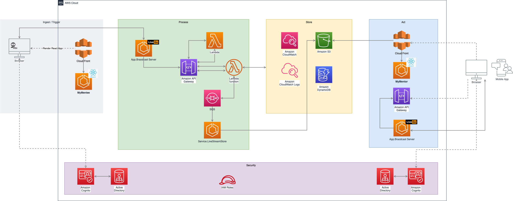

# Live Streaming Video

by. sjafrudin lamusu

## Overview

- The first application **MyMentor** will enable mentees in Indonesia to learn directly through mentors through live streaming
- The mentees will also be able to watch the recorded live stream at a later time
- The second application **MyMentee** will enable mentors to do live streaming to the mentees.
- We need to the recorded live stream to be available only for the mentors who did the live stream and for the mentees who participated at the live stream.
- We already currently targeted the first launch to reach 10k daily active users within the first month and grow 10% every month. Based on our market research, the users will most likely watch the live streams and recorded videos after office hours 18.00-20.00, outside that hours we expect only 20% of the daily users to watch.

  
## Solution Architecture
---

- **AWS** as Cloud Provider
- Serverless Architecture
- Elastic Container Service
- S3
- Simple Queue Service
- Dynamo DB

### FAQ

1. How does the Mentor do Live Streaming?
    - Mentors login to the MyMentee app with Amazon Cognito verification.

    - Mentors via the MyMentee web app start broadcast/live streaming videos. video files will be upstreamed to `rtmp://[livego-server]:1935/{appname}/{channelkey}`

1. How to record the live streaming video?
    - LiveGo in ECS when receiving upstream will hook to `POST https://[apigateway-internal-url]/store-live?appName={appname}` to trigger Service.LiveStreamStore

    - Lambda function mapped to url `https://[apigateway-internal-url]/store-live?app={appname}` will fire an event to SQS to trigger Service.LiveStreamStore

    - Service.LiveStreamStore will consume rtmp stream from LiveGo. And when the stream is complete, the video will be directly encoded into MP4 format, then stored in the S3 Bucket. Saved videos are publicly accessible via the CloudFront url. FilePath & video metadata will be stored in DynamoDB, via SQS event to Lambda Function.

1. How can videos be played by mentees through the MyMentor app?
    - MyMentor app can play the live video from LiveGo server, using Client Player which supports HLS format: `https://[livego-server]:7002/{appname}/movie.m3u8`.

1. Api Endpoint for the live streaming recordings?
    - MyMentor & MyMentee app can query metadata & filepath with endpoint `GET https://[apigateway-url]/store-live?app={appname}"`

 

### [LiveGo](https://github.com/gwuhaolin/livego)

Simple and efficient live broadcast server

Downstream playback: The following three playback protocols are supported, and the playback address is as follows:
    - `RTMP`: `rtmp://[livego-server]:1935/{appname}/movie`
    - `FLV`: `https://[livego-server]:7001/{appname}/movie.flv`
    - `HLS`: `https://[livego-server]:7002/{appname}/movie.m3u8`

 

### Video Client Player

[videojs-http-streaming-vhs](https://github.com/videojs/http-streaming#videojs-http-streaming-vhs)

  
## Cost Estimation
---

Monthly Cost: **773.92 USD**

12 Month Cost: **9,287.06 USD**

[Detail cost estimation](https://calculator.aws/#/estimate?id=83430e65080b9fe8246dcf241fa4b5d98d216294)

  
## Architecture Consideration
---

1. **Operational Excellence** 
How can your design help us to develop faster and operate easier?
    - Serverless in addition to providing an easier testing experience. And can increase productivity in terms of development & deployment.
     - Functional programming focuses on Data Model rather than Structure/Layer Encapsulation.
     - LiveGo written in Golang is a simple open source Broadcast server with reliable performance.

1. **Security** 
How does your design have ability to protect our assets from unwanted use?
    - Cloudfront with WAF plus authentication from Amazon Cognito will protect content from unauthorized users 

1. **Reliability** 
How can your design run correctly and consistently in time of failure?
    - We can monitor system performance via CloudWatch metrics.
    - Autoscale on ECS helps increase availability.
    - Serverless is one of reliable compute service.
    - Through Cloud Watch Alert system can notify when ECS is down or lambda function has exeptions.

1. **Performance Efficiency** 
How are your design able to use the computing resources efficiently?
    - Serverless has an advantage in terms of efficiency when compared to other Compute services
    - Cloud Front with cache helps improve the response for concurrent requests